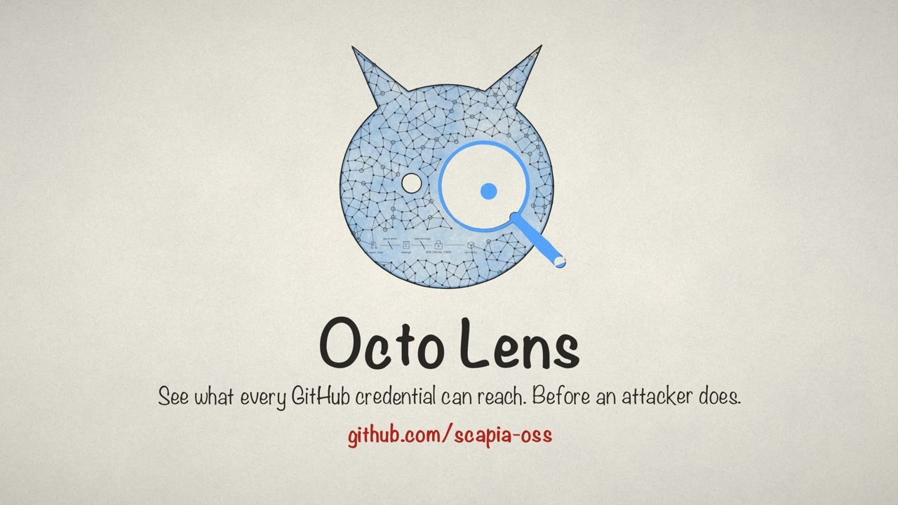

# Octo Lens

<p align="center">
  <a href="docs/octo-lens.mp4">
    
  </a>
  <br>
  <sub>▶ <a href="docs/octo-lens.mp4"><b>Watch the 1-minute launch video</b></a></sub>
</p>

Attack-surface mapping for every non-human identity in your GitHub organization —
fine-grained PATs, classic PATs, installed Apps, Actions secrets, deploy keys,
`GITHUB_TOKEN` defaults, and workflow configuration. Octo Lens doesn't just
inventory these credentials, it builds a reachability graph across them,
ranks attack paths to production by severity, and can independently verify
whether a secret is actually live (and what it can actually do) against its
real provider. Ships as both a CLI and a web dashboard.

## Features

- **Credential inventory** across 7 surfaces: fine-grained PATs, classic PATs
  (SSO orgs), installed GitHub Apps, Actions secrets (org/repo/environment),
  deploy keys, `GITHUB_TOKEN` default permissions, and workflow/action audit
  (unpinned actions, triggers, OIDC roles)
- **Attack-surface graph**: a directed reachability graph connecting
  principals → repos → workflows → secrets/roles → cloud accounts. Answers
  "what can this PAT reach if it leaks?" and "what breaks if I rotate this
  secret?" via forward/reverse BFS
- **Attack path ranking**: chains trigger → workflow → secret/role → boundary,
  scored by severity, with publisher-trust gating (a first-party
  `actions/checkout` tag isn't the same risk as an unpinned third-party action)
- **Secret verification pipeline**: pushes a short-lived, `contents: read`-only
  workflow into a repo that pattern-matches each secret's live value and tests
  it against its real provider (AWS, GitHub, Slack, OpenAI, Anthropic, Gemini,
  npm, SonarCloud), then cleans up the branch. For AWS, actually resolves
  attached policies and simulates effective permissions — not just "a secret
  named `AWS_*` exists"
- **Policy-as-code**: YAML rules across PATs, Apps, SSO, Secrets, Deploy Keys,
  and Workflows; `--policy` gates CI with a non-zero exit code on violation
- **Workflow SAST**: optional [zizmor](https://github.com/woodruffw/zizmor)
  integration for template injection, artifact poisoning, and other
  GitHub Actions-specific findings
- **Web dashboard**: interactive graph, drill-down, findings filtering
  (all / verified / unrecognized / unverified), JSON/CSV export
- **Scheduled monitoring**: auto-rescan on an interval, optional independent
  auto-verify interval, Slack alerts on new policy violations, GitHub webhook
  receiver for real-time rescans
- **Audit trail** (optional, requires MySQL): append-only event log with
  point-in-time queries — "what did this PAT look like on a given date?"

## Prerequisites

### GitHub App Setup

This tool requires a **GitHub App** because GitHub's fine-grained PAT listing
APIs are exclusively available to GitHub Apps.

1. Go to your org's settings: `https://github.com/organizations/<YOUR_ORG>/settings/apps/new`
2. Set the following **Organization permissions**:
   - **Personal access tokens**: Read-only
   - **Administration**: Read-only
   - **Members**: Read-only
   - **Secrets**: Read-only (for Actions secrets inventory)
   - **Actions**: Read and write (for the secret verification pipeline — it
     pushes a temporary branch/workflow and reads run results; safe to leave
     read-only if you don't need verification)
3. No webhook URL needed unless you want the real-time rescan-on-event
   receiver — see `--webhook-secret` below
4. Under "Where can this GitHub App be installed?", select "Only on this account"
5. Create the app, then note the **App ID** from the app's General page
6. Generate a **private key** (.pem file) and download it
7. Install the app on your organization

### Private Key Security

Set the private key file permissions:

```bash
chmod 600 your-app.pem
```

The tool will **refuse to start** if the private key file is readable by
group or others.

## Installation

```bash
git clone https://github.com/winters0x64/Octo-Lens.git
cd Octo-Lens
go build -o octo-lens .
```

> `go install` isn't wired up yet — the module path in `go.mod` doesn't match
> this repo's location, so building from a clone is the reliable path for now.

## Usage

### Configuration

Set credentials via environment variables (recommended — avoids exposing
secrets in process list):

```bash
export GITHUB_ORG=your-org
export GITHUB_APP_ID=123456
export GITHUB_APP_PRIVATE_KEY_PATH=./your-app.pem
# Optional: set if you don't want auto-discovery
# export GITHUB_INSTALLATION_ID=789
```

### CLI Scan

```bash
# Table output (default)
octo-lens scan

# JSON output (for piping/scripting)
octo-lens scan --output json

# CSV output (for spreadsheets)
octo-lens scan --output csv

# CI gate — evaluate against policy rules, exit 1 on violations
octo-lens scan --policy policy.yaml
```

### Web Dashboard

```bash
# Local-only (default, no auth required)
octo-lens serve

# With password auth (required for non-localhost)
export PAT_MONITOR_PASSWORD=your-secret-password
octo-lens serve --addr 0.0.0.0 --port 8080

# With Google SSO instead of a password
export GOOGLE_CLIENT_ID=...
export GOOGLE_CLIENT_SECRET=...
export GOOGLE_ALLOWED_DOMAIN=your-workspace-domain.com  # restrict sign-in to this Workspace domain
octo-lens serve --addr 0.0.0.0 --port 8080 --public-url https://octo-lens.your-domain.com

# With TLS
octo-lens serve --addr 0.0.0.0 --port 8443 --tls-cert cert.pem --tls-key key.pem

# Continuous monitoring: rescan hourly, re-verify secrets daily, alert to Slack
octo-lens serve \
  --scan-interval 1h \
  --verify-interval 24h \
  --policy policy.yaml \
  --slack-webhook "$SLACK_WEBHOOK_URL"
```

> **Note on `--google-allowed-domain`**: if you enable Google SSO and leave
> this unset, *any* verified Google account can sign in to the dashboard —
> always set it to your own Workspace domain in production.

The dashboard will be available at `http://127.0.0.1:8080` (or your
configured address).

### Secret Verification

The secret verification pipeline is opt-in and invasive by design — it pushes
a temporary branch and runs a GitHub Actions workflow per repo (`contents:
read` only), so it's exposed as an explicit action rather than something
that runs silently on every scan:

- **Manual**: click "Verify All" in the dashboard, or `POST /api/verify-all`
- **Scheduled**: set `--verify-interval` (e.g. `24h`) to sweep every
  not-yet-verified secret automatically on that cadence, independent of
  `--scan-interval`. A sweep across a large org can take 20+ minutes, so keep
  this interval much longer than your scan interval. Overlapping sweeps are
  automatically skipped rather than queued.

A secret's `verified` state, once set, carries forward across rescans as long
as its value hasn't changed (detected via its `updated_at` timestamp) — a
rescan never silently resets verification data.

## Security

- **Default bind**: `127.0.0.1` (localhost only)
- **Auth enforcement**: refuses to start on non-loopback addresses unless
  `PAT_MONITOR_PASSWORD` or `GOOGLE_CLIENT_ID`+`GOOGLE_CLIENT_SECRET` is set
- **Session-cookie auth**: password or Google OAuth, `HttpOnly`+`SameSite`
  session cookies
- **TLS support**: `--tls-cert` and `--tls-key` flags
- **CSP headers**: `default-src 'self'` prevents XSS
- **Rate limiting**: `POST /api/scan` limited to 1 request per 60 seconds
- **Private key validation**: refuses keys with permissions wider than `0600`
- **No secrets in logs**: custom logger redacts query parameters and auth headers
- **Verification pipeline is least-privilege**: the pushed workflow runs with
  `permissions: contents: read` only, and its temp branch is deleted
  immediately after the run completes

## API Endpoints

When running the dashboard, the following API endpoints are available
(non-exhaustive — see `internal/web/server.go` for the full route table):

| Method | Path | Description |
|--------|------|-------------|
| GET | `/api/summary` | Organization summary statistics |
| GET | `/api/pats` | List all fine-grained PATs (in-memory, latest scan) |
| GET | `/api/pats/{id}/repos` | Repositories accessible by a specific PAT |
| GET | `/api/pats/{id}/history` | Event log for a specific PAT (requires MySQL) |
| GET | `/api/pats/requests` | Pending PAT access requests |
| GET | `/api/events?since=&entity_type=&kind=&limit=` | Append-only event feed (requires MySQL) |
| GET | `/api/sso-credentials` | SSO authorized credentials (classic PATs, SSH keys) |
| GET | `/api/apps` | Installed GitHub Apps |
| GET | `/api/secrets` | Actions secrets (org/repo/environment scope) |
| GET | `/api/deploy-keys` | Deploy keys across all repos |
| GET | `/api/workflow-permissions` | `GITHUB_TOKEN` default permission per repo |
| GET | `/api/workflow-files` | Parsed workflow YAML audit (unpinned actions, triggers, OIDC) |
| GET | `/api/attack-graph` | Full reachability graph (nodes + edges) |
| GET | `/api/attack-graph/findings` | Ranked attack paths + prioritized action items |
| GET | `/api/blast-radius?id=<node>` | Forward/reverse BFS from a single node |
| GET | `/api/report` | Full organization report |
| GET | `/api/compliance` | Policy compliance checks |
| GET | `/api/diff` | Diff against the previous scan |
| GET | `/api/export` | JSON/CSV export |
| POST | `/api/scan` | Trigger a fresh scan (rate limited) |
| POST | `/api/verify-all` | Sweep every not-yet-verified secret |
| POST | `/api/verify-secrets` | Verify secrets for one specific repo |
| POST | `/api/verify-org-secrets` | Verify org-level secrets via a picked vehicle repo |

## Persistence (optional)

Setting `DATABASE_URL` enables MySQL persistence. The server keeps the
latest scan in memory for fast reads and writes a hybrid current+events
record to MySQL on every scan:

- **Current-state tables** (`pats`, `pat_requests`, `sso_credentials`) hold one row
  per entity with status: `active`, `expired`, `removed` — or `pending` /
  `resolved` for requests. Rows survive scans and persist when the process
  restarts.
- **Event log** (`events`) is append-only. Each row records a status flip or a
  watched-field change with a full JSON snapshot of the entity at that moment
  and a list of policy rule IDs the new state trips. Point-in-time queries do
  not require replaying events.
- **Removed-entity safety:** the scanner reports per-phase completeness flags
  (`scan_runs.pats_complete`, etc.). Diff and removed-detection only run for
  phases that completed cleanly, so a rate-limit blip does not mass-remove
  surviving credentials.

Run `docker compose up -d` to start MySQL alongside the app; the embedded
goose migrations apply automatically on startup. Disable auto-apply with
`--auto-migrate=false` if you prefer to run migrations out-of-band.

### Useful queries

```sql
-- Has this PAT ever held admin permissions?
SELECT 1 FROM events
WHERE entity_type='pat' AND entity_id='123'
  AND JSON_CONTAINS(policy_violations, '"pat.deny_admin_permissions"')
LIMIT 1;

-- Which PATs gained permissions silently last week?
SELECT entity_id, occurred_at, changed_fields
FROM events
WHERE entity_type='pat' AND event_kind='field_change'
  AND JSON_CONTAINS(changed_fields, '"permissions"')
  AND occurred_at > NOW() - INTERVAL 7 DAY;

-- What did this PAT look like on a given date?
SELECT snapshot FROM events
WHERE entity_type='pat' AND entity_id='123' AND occurred_at <= '2026-01-15'
ORDER BY occurred_at DESC LIMIT 1;
```

## Token Visibility Matrix

| Token Type | Requires | What's Visible |
|--|--|--|
| Fine-grained PATs | GitHub App | Full metadata: permissions, repos, expiry, last used |
| Classic PATs (SSO orgs) | SAML SSO enabled | Owner, last 8 chars, scopes, auth date, last accessed |
| Classic PATs (non-SSO orgs) | N/A | **Not visible** — no GitHub API exists for this |
| SSH Keys (SSO orgs) | SAML SSO enabled | Owner, fingerprint, auth date, last accessed |

## Limitations

- **Classic PATs without SSO**: If your org does not enforce SAML SSO, classic PATs cannot be enumerated by any tool (including StepSecurity). Consider [restricting classic PAT access](https://docs.github.com/en/organizations/managing-programmatic-access-to-your-organization/setting-a-personal-access-token-policy-for-your-organization) at the org level.
- **SSO credential scopes**: The SSO endpoint shows OAuth scopes (e.g., `repo`, `admin:org`) but not which specific repos the classic PAT has accessed.
- **GitHub App required**: A personal access token (classic or fine-grained) cannot access the fine-grained PAT listing endpoints — only GitHub Apps can.
- **Rate limits**: GitHub App tokens get 5,000-15,000 requests/hour depending on org size. Large organizations with many PATs may need to be mindful of scan frequency.
- **Secret verification format coverage**: the verification pipeline pattern-matches known credential formats (AWS, GitHub, Slack, OpenAI, Anthropic, Gemini, npm, SonarCloud). A secret whose value doesn't match any of these (an SSH key, a webhook URL, a plain config value) is reported as **unrecognized**, not confirmed dead — treat that state as unresolved risk, not a clean bill of health.
